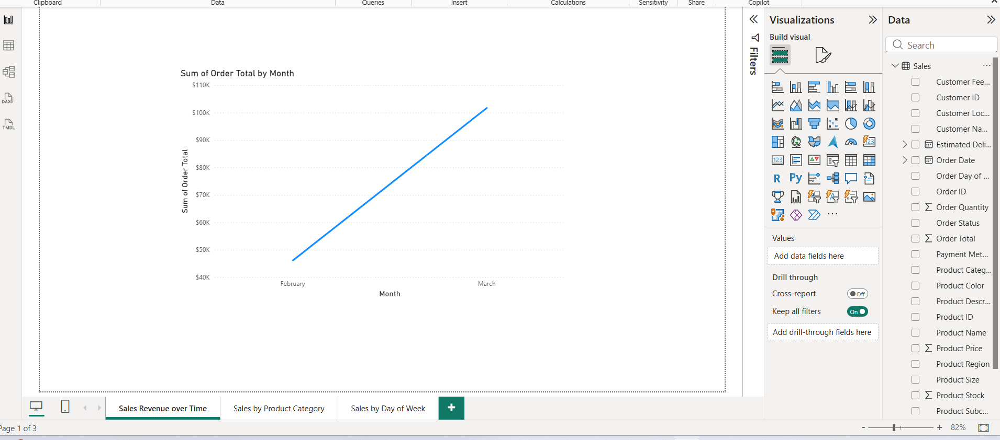
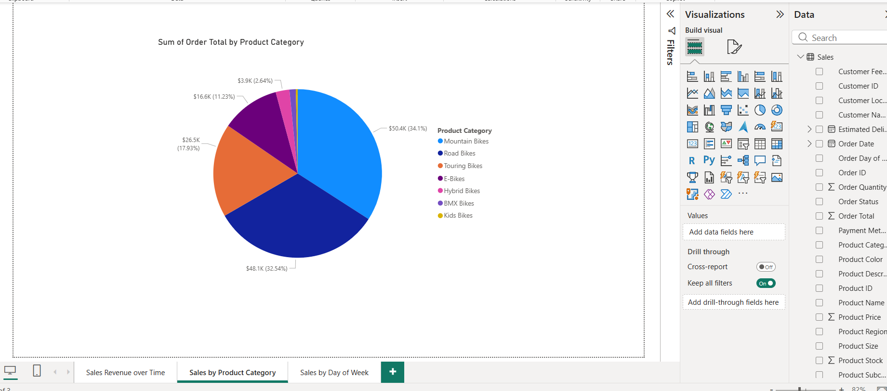
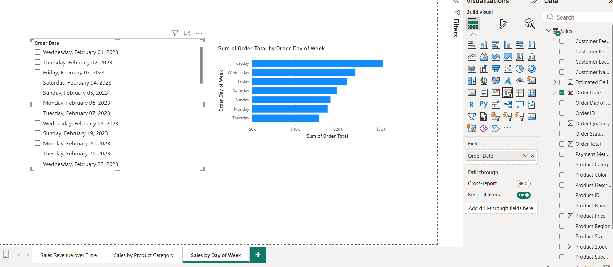
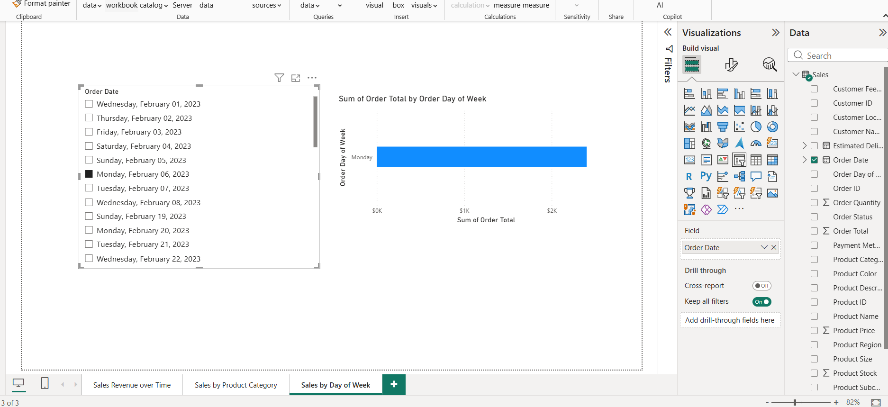

# Create a Sales Report – Power BI

## 📌 Overview
This project demonstrates a basic sales analysis dashboard created using Power BI.  
The report focuses on understanding sales trends, product performance, and daily sales behavior.

## 📊 Key Visualizations
- Sales Revenue over Time (Line Chart)
- Sales by Product Category (Pie Chart)
- Sales by Day of Week (Bar Chart)
- Interactive slicers for date filtering

## 🛠 Tools Used
- Power BI Desktop
- Sample sales dataset

## 📷 Screenshots
Screenshots of the dashboard are available below.## 📸 Dashboard Screenshots

### 1️⃣ Sales Revenue over Time

### 2️⃣ Sales by Product Category

### 3️⃣ Sales by Day of Week

### 4️⃣ Date Slicer – Filter View

### 5️⃣ Date Slicer – Applied Selection

