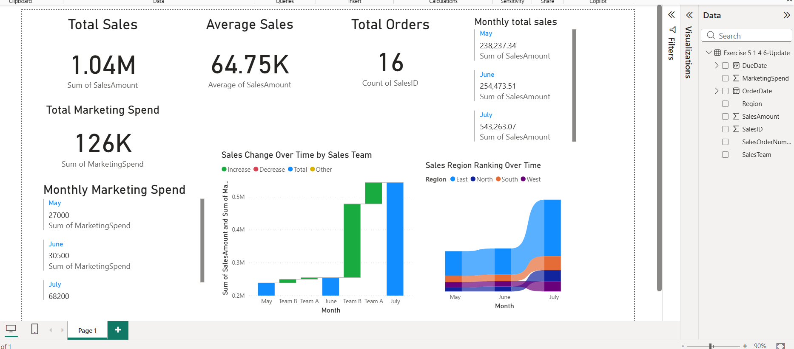

# Indicating Business Performance – Sales Report (Power BI)

## 📌 Overview
This project analyzes sales and marketing performance for Adventure Works over a three-month period using Power BI.  
The dashboard highlights key business KPIs, sales trends, marketing expenditure, and regional performance to support data-driven decision-making.

---

## 📊 Key KPIs
- **Total Sales**
- **Average Sales**
- **Total Orders**
- **Total Marketing Spend**

---

## 📈 Visualizations Included
- Monthly Total Sales
- Monthly Marketing Spend
- Sales Change Over Time by Sales Team (Waterfall Chart)
- Sales Region Ranking Over Time (Ribbon Chart)
- Correlation between Marketing Spend and Sales Performance

---

## 🧠 Business Insights
- Identifies months with higher and lower sales performance
- Shows how marketing spend aligns with sales growth
- Highlights top-performing sales regions and ranking changes
- Helps evaluate effectiveness of advertising campaigns

---
## 🔍 Key Insights

- Total Sales reached 1.04M over the analyzed period
- Marketing spend increased significantly in July, correlating with higher sales
- East and North regions showed strong growth compared to others
- Sales Team A contributed the highest increase in July

## 🖼 Dashboard Screenshots

## 📊 Dashboard Preview

Below is the Power BI dashboard created to analyze sales and marketing performance:

---
## 📄 Detailed Analysis Report

A detailed written analysis explaining KPIs, sales trends, marketing spend, and regional performance is available here:

➡️ [View Analysis Report](Indicating_Business_Performance_Analysis.docx)

## 🛠 Tools Used
- Power BI Desktop
- Sample Adventure Works Dataset

