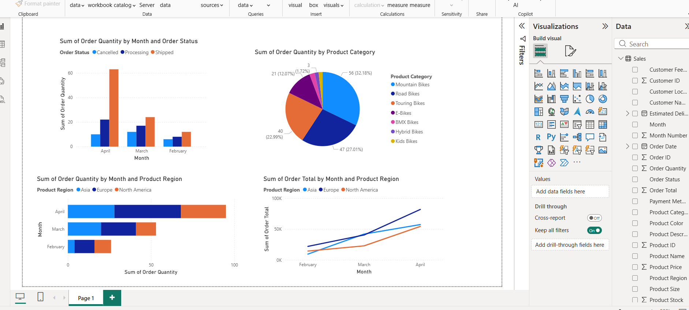
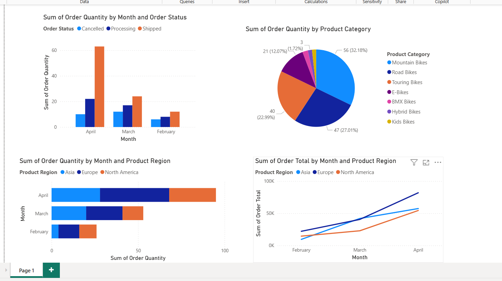

# Using Bars, Columns, and Lines – Power BI

## 📌 Overview
This project demonstrates the use of bar charts, column charts, and line charts in Power BI
to analyze order quantity and sales trends across months, product categories, and regions.

## 📊 Visualizations Included
- Order Quantity by Month and Order Status
- Order Quantity by Product Category
- Order Quantity by Month and Product Region
- Order Total by Month and Product Region (Line Chart)

## 📸 Dashboard Screenshots

### Full Dashboard View

### Detailed Dashboard View

⚠️ Source `.pbix` file is not shared. This repository showcases dashboard outputs and insights.

